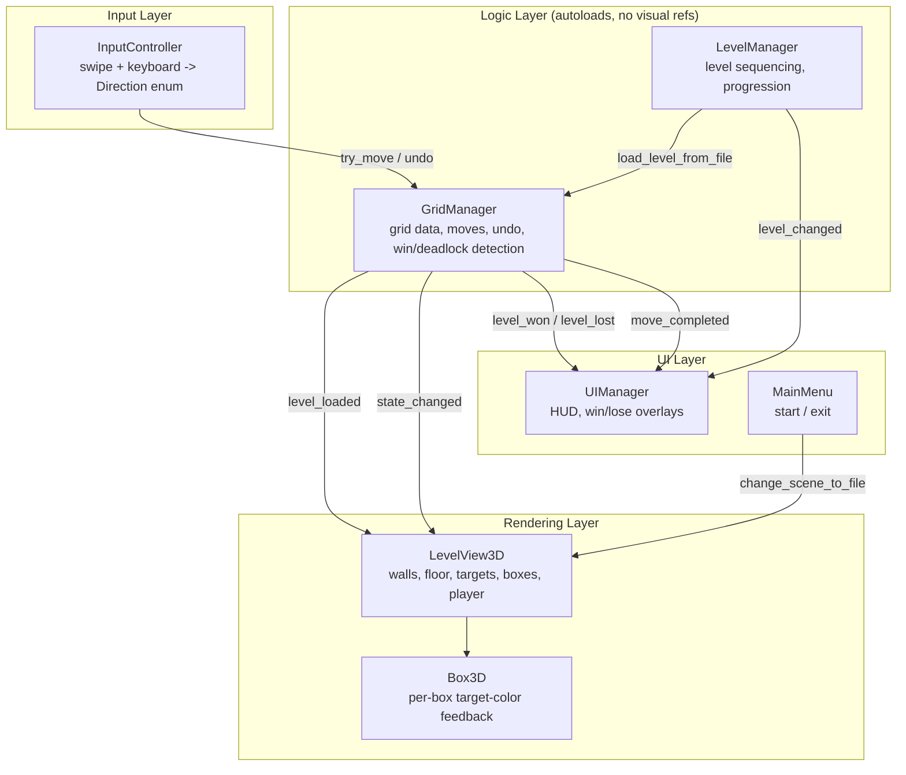
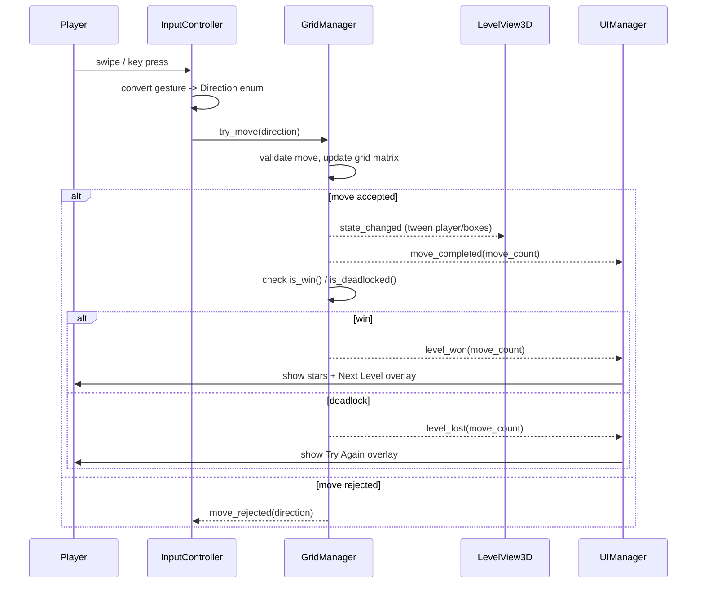

# Sokoban Grid Puzzle

Grid-based Sokoban puzzle built in Godot 4.7, submitted for the Capsitech technical assignment ("Project Engineering & Architecture Assignment: Grid Puzzle Challenge"). 
**Prebuilt APK:** [Download / Play on itch.io](https://nareshraj.itch.io/sabokan)
## Features

- **N × M grid simulation** — grid data is fully decoupled from rendering; the parser (`GridManager._parse_row`) pads ragged/short rows with floor cells, so non-rectangular layouts are supported even though the 5 shipped levels are all rectangular
- **Swipe-based input** — touch drag vector tracking on mobile, keyboard (WASD/arrows) for editor testing
- **Deterministic undo/move history** — snapshot-based, one action = one step, no rollback of the step counter
- **Win detection** with a 3-star rating against a per-level par move count
- **Deadlock detection** — flags unsolvable corner-stuck states as a distinct lose condition
- **Game-over lock** — once a level is won or deadlocked, `GridManager` freezes further moves *and* undo until the next level loads, so a swipe/keypress can't keep editing a finished board while the win/lose overlay is still animating in
- **Fade-in overlay transitions** — win/lose/credits overlays wait briefly for the last move's tween to finish, then fade in (`UIManager.overlay_delay` / `overlay_fade_time`), instead of snapping on top of an in-progress animation
- **5-level progression** with Next Level / Restart flow
- **Main menu** — Start Game / Exit

## System Architecture Map

The core design principle: **grid logic never touches rendering or UI, and rendering/UI never mutate grid logic.** Every cross-boundary interaction happens through signals — `GridManager` and `LevelManager` broadcast state, everything else reacts.



**Key decoupling points:**
- `GridManager` holds zero references to `Sprite3D`/`MeshInstance3D`/any visual node — it's a plain `Node` with arrays and enums.
- `LevelView3D` never mutates `GridManager`'s data; it only reads and reacts to signals.
- `UIManager` never touches 3D rendering; it only reads `GridManager`/`LevelManager` state and reacts to their signals.

**Edge case — input after game over:** `GridManager` tracks an internal `_game_over` flag, set the instant `is_win()`/`is_deadlocked()` is true. `try_move()` and `undo()` both bail out immediately while it's set, and it resets whenever a new level loads (`_reset_state()`). This matters because `Control.mouse_filter` on the win/lose overlays only blocks mouse/touch input to the UI underneath — it does nothing to stop keyboard or swipe input from still reaching `try_move()` while the overlay is on screen. Locking the flag at the `GridManager` level (rather than, say, disabling `InputController`) keeps the fix in the one place that already owns "is this move legal."

## Functional Code Flow

The required pipeline, as actually implemented:



On a **new level load** (initial load, Next Level, Restart), `GridManager` emits `level_loaded` instead of `state_changed`, which tells `LevelView3D` to fully tear down and rebuild the static geometry (walls/floor/targets) and dynamic entities (boxes/player) — since a new level's shape/size can differ entirely from the previous one.

Once `level_won` or `level_lost` fires, the board is frozen (see the edge-case note above) and `UIManager` fades its overlay in over `overlay_delay` + `overlay_fade_time` seconds rather than snapping `visible = true` instantly, so the transition doesn't cut across the last move's slide-into-place tween.

## Project Structure

```
scripts/
├── core/
│   ├── GridManager.gd      # autoload — grid data, moves, undo, win/deadlock logic
│   └── LevelManager.gd     # autoload — level file sequencing & progression
├── input/
│   └── InputController.gd  # swipe + keyboard -> GridManager
├── view/
│   ├── LevelView3D.gd      # renders grid state in 3D, reacts to signals only
│   └── Box3D.gd            # per-box on-target visual feedback
└── ui/
	├── UIManager.gd         # HUD, win/lose overlays
	└── MainMenu.gd          # start/exit menu

levels/
├── level_01.txt … level_05.txt   # plain-text layouts (# wall, . floor, T target, $ box, @ player)

Scene/
├── main.tscn        # gameplay scene (LevelView3D + InputController + UI)
├── main_menu.tscn   # entry point (run/main_scene)
└── ui/ui.tscn        # HUD + WinOverlay + LoseOverlay
```

## Level Format

Plain text, one file per level:

| Symbol | Meaning |
|---|---|
| `#` | wall |
| `.` | floor |
| `T` | target marker |
| `$` | box (on floor) |
| `B` | box already on a target |
| `@` | player (on floor) |
| `P` | player already on a target |

Rows may have ragged lengths — `GridManager._parse_row` pads any row shorter than the widest row with floor cells, so non-rectangular layouts are supported by the parser. The 5 shipped levels are all plain rectangles; none currently exercises this padding path.

## Deadlock Detection — Scope Note

`GridManager.is_deadlocked()` currently detects **corner deadlocks** only: a box not on a target that has a wall on one horizontal side *and* one vertical side simultaneously. This is intentionally scoped — it catches the large majority of unsolvable states a player creates, in O(boxes) time with no extra memory, but does not detect harder cases like two boxes freezing each other flat against a wall, or multi-box "freeze" chains. Documented as a known limitation rather than silently ignored.

## Running the Project

1. Open the project in **Godot 4.7**.
2. Press Play — `main_menu.tscn` is the configured main scene.
3. **Start** loads `Scene/main.tscn` and begins Level 1.

## Building the APK

**Prebuilt APK:** [Download / Play on itch.io](https://nareshraj.itch.io/sabokan)

1. **Project → Export...** → select the Android preset.
2. Under **Resources → Filters to export non-resource files/folders**, ensure `levels/*.txt` is included (plain-text level files aren't bundled by default).
3. Export → produces the `.apk` for distribution.

## Controls

- **Swipe** (mobile) or **Arrow keys / WASD** (desktop/editor) — move
- **Z** (keyboard) / **Undo** button — undo last move
